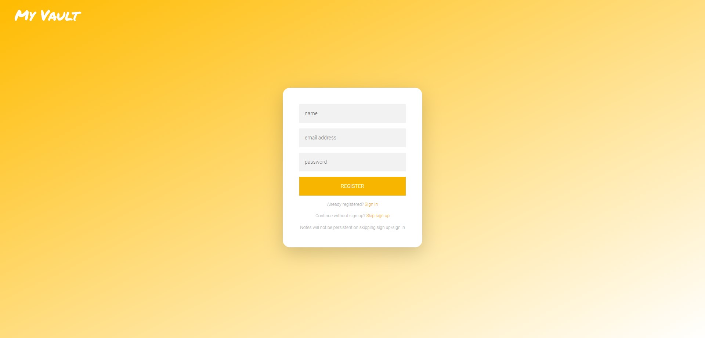
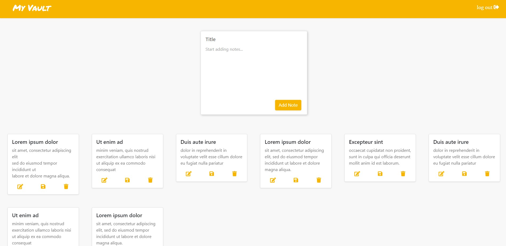
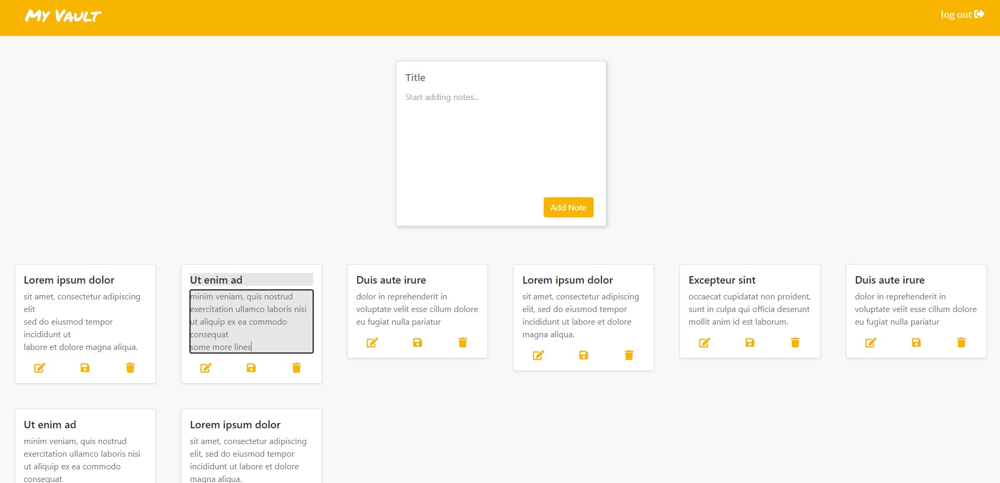
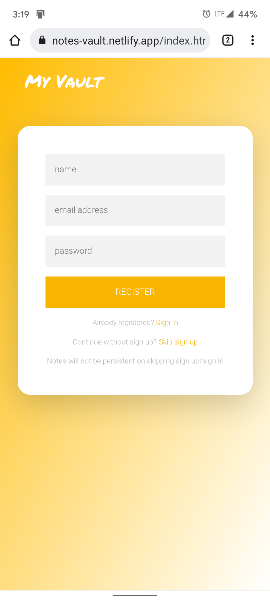
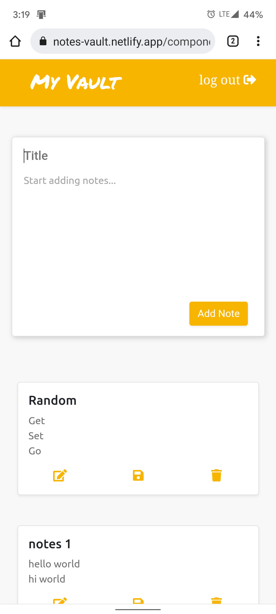

# notes-vault
Notes taking website.\
\
Front End-> HTML, CSS, JS\
Back End->  NodeJS, Express, MongoDB\
<a href="https://github.com/RandomGuy1793/api-notes_vault">Back End repo link</a>
 
 
 
Sample screenshots:-
 

Desktop-

   
   
  
   
   
  
   
   
  
Mobile-

  
  

